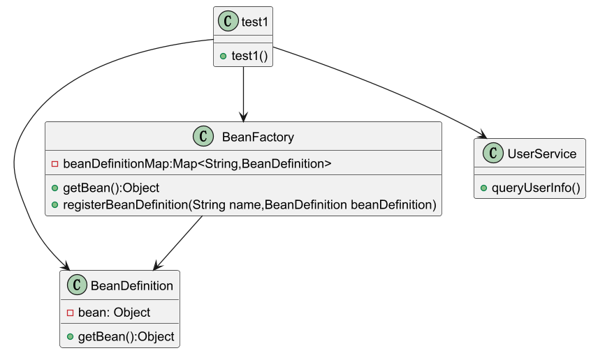
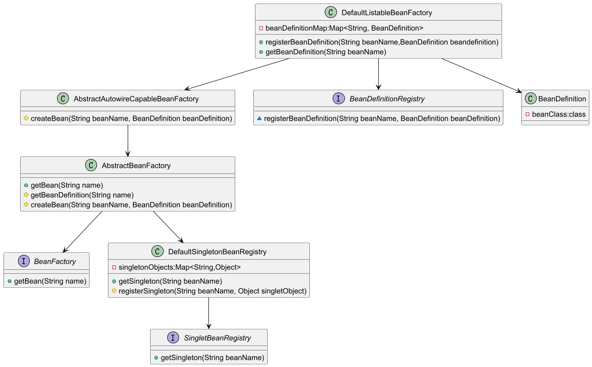
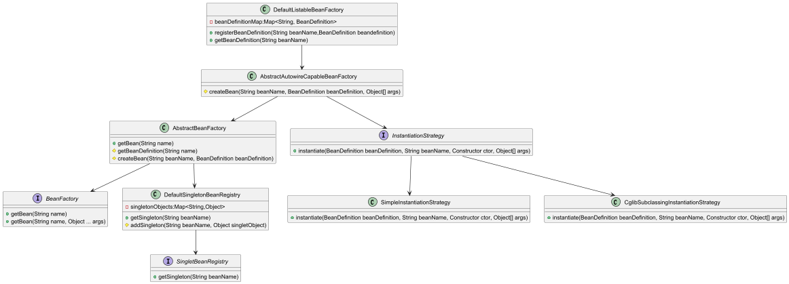

# IOC容器

### 简单的 spring bean容器

##### spring bean容器包含并管理应用对象的配置和生命周期

+ 承载对象的容器，每个bean的创建交互构建和使用

+ 把bean对象交给spring bean容器管理，bean对象会会被拆解，存储到spring bean容器中，便于管理，相当于把bean对象解耦

+ 实现简单的spring bean容器需要完成Bean对象的定义注册和获取三个部分

   

  + BeanDefinition  定义Bean对象，以一个Object类型存储对象

    ```Java
    package org.xinen;
    /*
     * BeanDefinition 用于定义一个 bean对象 以一个Object类型存储对象
     */
    public class BeanDefinition {
        private Object bean;
        public BeanDefinition(Object bean){
            this.bean = bean;
        }
        public Object getBean(){
            return this.bean;
        }
    }
    ```

  + BeanFactory  Bean对象的工厂，将bean对象存储到Map中以便获取对象

    ```Java
    package org.xinen;
    import java.util.Map;
    import java.util.concurrent.ConcurrentHashMap;
    /*
     * BeanFactory 生成和使用Bean对象的工厂，将Bean对象的定义存储到Map中以便获取
     */
    public class BeanFactory {
        private Map<String,BeanDefinition> beanDefinitionMap = new ConcurrentHashMap<>();
        /*
         * 根据Bean的名称获取Bean对象
         */
        public Object getBean(String name){
            return beanDefinitionMap.get(name).getBean();
        }
        /*
         * 注册BeanDefinition 对象
         */
        public void registerBeanDefinition(String name, BeanDefinition beanDefinition){
            beanDefinitionMap.put(name,beanDefinition);
        }
    }
    ```

  + test1  Junit测试类

    ```Java
    import org.junit.Test;
    import org.xinen.BeanDefinition;
    import org.xinen.BeanFactory;
    public class teat_BeanFactory {
        @Test
        public void test1(){
            // 1. 初始化BeanFactory
            BeanFactory beanFactory = new BeanFactory();
            // 2.注册bean
            BeanDefinition beanDefinition = new BeanDefinition(new UserService());
            beanFactory.registerBeanDefinition("userService",beanDefinition);
            // 3.获取bean
            UserService userService = (UserService)beanFactory.getBean("userService");
            userService.queryUserInfo();
        }
    }
    ```

   + UserService  测试的对象

     ```Java
     package org.xinen.test;
     
     public class UserService {
         public void queryUserInfo(){
             System.out.println("查询用户信息");
         }
     }
     ```

---

### 实现Bean对象的定义注册获取

​	通过spring容器创建对象，而不是调用一个实例化的bean对象

##### 完善容器设计

+ 注册Bean对象时，注册一个类信息，而不是实例化对象信息

+ 获取bean对象的时候进行实例化，以及判断bean对象是否已经存在

  

  + BeanFactory  是通过AbstractBeanFactory抽象类实现的getBean方法来定义

    ```Java
    public interface BeanFactory {
        Object getBean(String name) throws BeansException;
    }
    
    public abstract class AbstractBeanFactory extends DefaultSingletonBeanRegistry implements BeanFactory {
        @Override
        public Object getBean(String name) throws BeansException {
            Object bean = getSingleton(name);
            if(bean != null){
                return bean;
            }
            BeanDefinition beanDefinition = getBeanDefinition(name);
            return createBean(name, beanDefinition);
        }
        protected abstract BeanDefinition getBeanDefinition(String name) throws BeansException;
        protected abstract Object createBean(String beanName, BeanDefinition beanDefinition) throws BeansException;
    }
    ```

  + AbstractBeanFactory  继承了SingletonBeanRegistry接口的DefaultSingletonBeanRegistry类，具备单例对象的注册方法

    ```Java
    public interface SingletonBeanRegistry {
        Object getSingleton(String beanName);
        void registerSingleton(String beanName, Object singletonObject);
    }
    
    public class DefaultSingletonBeanRegistry implements SingletonBeanRegistry{
        private Map<String, Object> singletonObjects = new HashMap<>();
        @Override
        public Object getSingleton(String beanName) {
            return singletonObjects.get(beanName);
        }
        @Override
        public void registerSingleton(String beanName, Object singletonObject) {
            singletonObjects.put(beanName,singletonObject);
        }
    }
    ```

  + AbstractBeanFactory  定义了getBeanDefinition()和createBean()两种抽象方法，分别由DefaultListableBeanFactory类和AbstractAutowireCapableBeanFactory类实现

  + ```Java
    public abstract class AbstractBeanFactory extends DefaultSingletonBeanRegistry implements BeanFactory {
        @Override
        public Object getBean(String name) throws BeansException {
            Object bean = getSingleton(name);
            if(bean != null){
                return bean;
            }
            BeanDefinition beanDefinition = getBeanDefinition(name);
            return createBean(name, beanDefinition);
        }
        protected abstract BeanDefinition getBeanDefinition(String name) throws BeansException;
        protected abstract Object createBean(String beanName, BeanDefinition beanDefinition) throws BeansException;
    }
    
    public abstract  class AbstractAutowireCapableBeanFactory extends AbstractBeanFactory{
        @Override
        protected Object createBean(String beanName, BeanDefinition beanDefinition) throws BeansException{
            Object bean = null;
            try{
                bean = beanDefinition.getBeanClass().newInstance();
            }catch (Exception e){
                throw new BeansException("Instantiation of bean failed", e);
            }
            registerSingleton(beanName, bean);
            return bean;
        }
    }
    ```

  + DefaultListableBeanFactory  继承抽象类AbstractAutowireCapableBeanFactory，可以调用该抽象类的createBean()方法

    ```Java
    public interface BeanDefinitionRegistry {
        void registerBeanDefinition(String beanName, BeanDefinition beanDefinition);
    }
    
    public class DefaultListableBeanFactory extends AbstractAutowireCapableBeanFactory implements BeanDefinitionRegistry{
        private Map<String,BeanDefinition> beanDefinitionMap = new HashMap<>();
        @Override
        protected BeanDefinition getBeanDefinition(String name) throws BeansException {
            BeanDefinition beanDefinition = beanDefinitionMap.get(name);
            if(beanDefinition == null) {
                throw new BeansException("No bean named'" + name + "' is defined");
            }
            return beanDefinition;
        }
        @Override
        public void registerBeanDefinition(String beanName, BeanDefinition beanDefinition) {
            beanDefinitionMap.put(beanName,beanDefinition);
        }
    }
    ```

---

### 基于Cglib实现含构造函数类实例化策略

​	基于策略模式实现两种用于实例化对象的方法，JDK、Cglib

##### 实例化没有考虑类中是否有带入参信息的构造函数

+ 在上个版本中添加 InstantiationStrategy 实例化策略接口、开发对应的JDK和Cglib实例化方法，补充带参数的getBean()构造函数

  

  + 在BeanFactory类中新增 getBean()接口

    ```Java
    public interface BeanFactory {
        Object getBean(String name) throws BeansException;
        Object getBean(String name,Object[] ... args) throws BeansException;
    }
    ```

  + 接口InstantiationStrategy的instantiate构造函数添加必要的入参信息

    ```Java
    import java.lang.reflect.Constructor;
    public interface InstantiationStrategy {
        Object instantiate(BeanDefinition beanDefinition, String beanName, Constructor ctor, Object[] args)throws BeansException;
    }
    ```

  + JDK 实例化

    ```Java
    public class SimpleInstantiationStrategy implements InstantiationStrategy {
        @Override
        public Object instantiate(BeanDefinition beanDefinition, String beanName, Constructor ctor, Object[] args) throws BeansException {
            Class clazz = beanDefinition.getBeanClass();
            try {
                if (null != ctor) {
                    return clazz.getDeclaredConstructor(ctor.getParameterTypes()).newInstance(args);
                } else {
                    return clazz.getDeclaredConstructor().newInstance();
                }
            } catch (NoSuchMethodException | InstantiationException | IllegalAccessException | InvocationTargetException e) {
                throw new BeansException("Failed to instantiate [" + clazz.getName() + "]", e);
            }
        }
    }
    ```

  + Cglib 实例化

    ```Java
    public class CglibSubclassingInstantiationStrategy implements InstantiationStrategy{
        @Override
        public Object instantiate(BeanDefinition beanDefinition, String beanName, Constructor ctor, Object[] args) throws BeansException {
            Enhancer enhancer = new Enhancer();
            enhancer.setSuperclass(beanDefinition.getBeanClass());
            enhancer.setCallback(new NoOp() {
                @Override
                public int hashCode() {
                    return super.hashCode();
                }
            });
            if (null == ctor) {
                return enhancer.create();
            }
            return enhancer.create(ctor.getParameterTypes(), args);
        }
    }
    ```

  + AbstractAutowireCapableBeanFactory  创建策略调用

    ```Java
    public abstract  class AbstractAutowireCapableBeanFactory extends AbstractBeanFactory {
        private InstantiationStrategy instantiationStrategy = new CglibSubclassingInstantiationStrategy();
        @Override
        protected Object createBean(String beanName, BeanDefinition beanDefinition, Object[] args) throws BeansException {
            Object bean = null;
            try {
                bean = createBeanInstance(beanDefinition, beanName, args);
            } catch (Exception e) {
                throw new BeansException("Instantiation of bean failed", e);
            }
    
            registerSingleton(beanName, bean);
            return bean;
        }
        protected Object createBeanInstance(BeanDefinition beanDefinition, String beanName, Object[] args) {
            Constructor constructorToUse = null;
            Class<?> beanClass = beanDefinition.getBeanClass();
            Constructor<?>[] declaredConstructors = beanClass.getDeclaredConstructors();
            for (Constructor ctor : declaredConstructors) {
                if (null != args && ctor.getParameterTypes().length == args.length) {
                    constructorToUse = ctor;
                    break;
                }
            }
            return getInstantiationStrategy().instantiate(beanDefinition, beanName, constructorToUse, args);
        }
        public InstantiationStrategy getInstantiationStrategy() {
            return instantiationStrategy;
        }
        public void setInstantiationStrategy(InstantiationStrategy instantiationStrategy) {
            this.instantiationStrategy = instantiationStrategy;
        }
    }
    ```

---

### 注入属性和依赖对象

​	将PropertyValues引入BeanDefinition定义，在对象实例化完成后填充Bean对象的属性


+ PropertyValue和PropertyValues传递Bean对象创建过程中所需要的属性信息

  ```Java
  @AllArgsConstructor
  @Data
  public class PropertyValue {
      private final String name;
      private final Object value;
  }
  
  public class PropertyValues {
      private final List<PropertyValue> propertyValueList = new ArrayList<>();
      public void addPropertyValue(PropertyValue pv){
          this.propertyValueList.add(pv);
      }
      public PropertyValue[] getPropertyValues(){
          return this.propertyValueList.toArray(new PropertyValue[0]);
      }
      public PropertyValue getPropertyValue(String propertyName){
          for (PropertyValue pv : this.propertyValueList){
              if (pv.getName().equals(propertyName)){
                  return pv;
              }
          }
          return null;
      }
  
  }
  ```

  + beanDefinition  填充了PropertyValues属性

    ``` Java
    @Data
    public class BeanDefinition {
        private Class beanClass;
        private PropertyValues propertyValues;
        public BeanDefinition(Class beanClass){
            this.beanClass = beanClass;
            this.propertyValues = new PropertyValues();
        }
        public BeanDefinition(Class beanClass, PropertyValues propertyValues){
            this.beanClass = beanClass;
            this.propertyValues = propertyValues!=null ? propertyValues : new PropertyValues();
        }
    }
    ```

  + AbstractAutowireCapableBeanFactory  

    ```Java
    public abstract  class AbstractAutowireCapableBeanFactory extends AbstractBeanFactory {
        private InstantiationStrategy instantiationStrategy = new SimpleInstantiationStrategy();
        @Override
        protected Object createBean(String beanName, BeanDefinition beanDefinition, Object[] args) throws BeansException {
            Object bean = null;
            try {
                bean = createBeanInstance(beanDefinition, beanName, args);
                // 给Bean对象填充属性
                applyPropertyValues(bean, beanName, beanDefinition);
            } catch (Exception e) {
                throw new BeansException("Instantiation of bean failed", e);
            }
            registerSingleton(beanName, bean);
            return bean;
        }
        protected Object createBeanInstance(BeanDefinition beanDefinition, String beanName, Object[] args) {
            Constructor constructorToUse = null;
            Class<?> beanClass = beanDefinition.getBeanClass();
            Constructor<?>[] declaredConstructors = beanClass.getDeclaredConstructors();
            for (Constructor ctor : declaredConstructors) {
                if (null != args && ctor.getParameterTypes().length == args.length) {
                    constructorToUse = ctor;
                    break;
                }
            }
            return getInstantiationStrategy().instantiate(beanDefinition, beanName, constructorToUse, args);
        }
        public InstantiationStrategy getInstantiationStrategy() {
            return instantiationStrategy;
        }
        public void setInstantiationStrategy(InstantiationStrategy instantiationStrategy) {
            this.instantiationStrategy = instantiationStrategy;
        }
        /*
         *  Bean对象属性填充
         */
        protected void applyPropertyValues(String beanName, Object bean, BeanDefinition beanDefinition){
            try{
                PropertyValues propertyValues = beanDefinition.getPropertyValues();
                for(PropertyValue pv : propertyValues.getPropertyValues()){
                    String name = pv.getName();
                    Object value = pv.getValue();
                    if(value instanceof BeanReference){
                        BeanReference beanReference =  (BeanReference) value;
                        value = getBean(beanReference.getBeanName());
                    }
                    BeanUtil.setFieldValue(bean, name, value);
                }
            }catch(Exception e){
                throw new BeansException("Error setting property values:" + beanName);
            }
        }
    }
    ```
---

### 资源加载器解析文件文件注册对象

​	在现有的spring框架添加能够实现spring配置的读取、解析和Bean对象注册，通过spring配置文件将Bean对象实例化。

+ 添加一个资源加载器读取ClassPath、File、HTTP文件的配置内容(Bean对象的描述信息和属性信息)，读取到配置文件内容后先将配置文件中的Bean描述信息解析再注册，将Bean对象注册到SpringBean容器中。


###### 资源加载接口的定义与实现

+ 定义Resource接口，提供获取InputStream流的方法然后分别实现三种不同的流文件

  ```Java
  public interface Resource {
      InputStream getInputStream() throws IOException;
  }
  ```

+ 通过ClassLoader读取ClassPath中的文件信息，具体读取命令是classLoader.getResourceAsStream(path)

  ```Java
  public class ClassPathResource implements Resource {
      private final String path;
      private ClassLoader classLoader;
      public ClassPathResource(String path) {
          this(path, (ClassLoader) null);
      }
      public ClassPathResource(String path, ClassLoader classLoader) {
          Assert.notNull(path, "Path must not be null");
          this.path = path;
          this.classLoader = (classLoader != null ? classLoader : ClassUtils.getDefaultClassLoader());
      }
      @Override
      public InputStream getInputStream() throws IOException {
          InputStream is = classLoader.getResourceAsStream(path);
          if (is == null) {
              throw new FileNotFoundException(
                      this.path + " cannot be opened because it does not exist");
          }
          return is;
      }
  }
  ```

+ 通过指定文件路径的方式读取文件信息时会读到一些TXT文件和Excel文件将这些文件输出到控制台

  ```Java
  public class FileSystemResource implements Resource {
      private File file;
      private String path; 
      public FileSystemResource (File file){
          this.file = file;
          this.path = file.getPath();
      }
      public FileSystemResource (String path){
          this.file = new File(path);
          this.path = path;
      }
      @Override
      public InputStream getInputStream() throws IOException {
          return new FileInputStream(this.file);
      }
      public final String getPath(){
          return this.path;
      }
  }
  ```

+ 通过HTTP读取远程云文件(HTTP文件)

  ```Java
  public class UrlResource implements Resource{
      private URL url;
      public UrlResource(URL url){
          Assert.assertNotNull("url must not be null",url);
          this.url = url;
      }
      @Override
      public InputStream getInputStream() throws IOException {
          URLConnection com = this.url.openConnection();
          try{
              return com.getInputStream();
          }catch(IOException e){
              if(com instanceof HttpsURLConnection){
                  ((HttpsURLConnection) com).disconnect();
              }
              throw e;
          }
      }
  }
  ```

##### 包装资源加载器

+ 定义获取资源的接口，在接口中传递资源

  ```Java
  public interface ResourceLoader {
      String CLASSPATH_URL_PREFIX = "classpath:";
      Resource getResource(String location);
  }
  ```

+ 获取资源

  ```Java
  public class DefaultResourceLoader  implements ResourceLoader{
      @Override
      public Resource getResource(String location) {
          Assert.notNull(location,"Location must not be  null");
          if(location.startsWith(CLASSPATH_URL_PREFIX)){
              return new ClassPathResource(location.substring(CLASSPATH_URL_PREFIX.length()));
          }else{
              try{
                  URL url = new URL(location);
                  return new UrlResource(url);
              }catch(MalformedURLException e){
                  return new FileSystemResource(location);
              }
          }
      }
  }
  ```

##### Bean对象定义读取接口

+ BeanDefinitionReader 用于读取Bean对象定义的简单接口

  ```Java
  public interface BeanDefinitionReader {
      BeanDefinition getRegistry();
      ResourceLoader getResourceLoader();
      void loadBeanDefinitions(Resource resource)  throws BeansException;
      void loadBeanDefinitions(Resource... resources) throws BeansException;
      void loadBeanDefinitions(String location) throws BeansException;
  }
  ```

##### Bean定义抽象类实现

+  AbstractBeanDefinitionReader抽象类实现了BeanDefinitionReader接口的前两个方法，并提供了构造函数此时可以通过外部调用将Bean对象的定义注入并传递到类中；在BeanDefinitionReader接口的具体实现类中可以将解析的XML文件中的Bean对象信息注册到SpringBean容器中

  ```Java
  public abstract class AbstractBeanDefinitionReader implements BeanDefinitionReader{
      private final BeanDefinitionRegistry registry;
      private ResourceLoader resourceLoader;
      protected AbstractBeanDefinitionReader(BeanDefinitionRegistry registry) {
          this(registry, new DefaultResourceLoader());
      }
      public AbstractBeanDefinitionReader(BeanDefinitionRegistry registry, ResourceLoader resourceLoader) {
          this.registry = registry;
          this.resourceLoader = resourceLoader;
      }
      @Override
      public BeanDefinitionRegistry  getRegistry() {
          return registry;
      }
      @Override
      public ResourceLoader getResourceLoader() {
          return resourceLoader;
      }
  }
  ```

##### 解析XML处理Bean注册

+ XmlBeanDefinitionReader对XML文件解析，通过解析XML文件自动注册的方式实现

```Java
public class XmlBeanDefinitionReader extends AbstractBeanDefinitionReader {

    public XmlBeanDefinitionReader(BeanDefinitionRegistry registry) {
        super(registry);
    }

    public XmlBeanDefinitionReader(BeanDefinitionRegistry registry, ResourceLoader resourceLoader) {
        super(registry, resourceLoader);
    }

    @Override
    public void loadBeanDefinitions(Resource resource) throws BeansException {
        try (InputStream inputStream = resource.getInputStream()){
            doLoadBeanDefinitions(inputStream);
        } catch (IOException | ClassNotFoundException e) {
            throw new BeansException("IOException parsing XML document from " + resource, e);
        }
    }

    @Override
    public void loadBeanDefinitions(Resource... resources) throws BeansException {
        for (Resource resource : resources) {
            loadBeanDefinitions(resource);
        }
    }

    @Override
    public void loadBeanDefinitions(String location) throws BeansException {
        ResourceLoader resourceLoader = getResourceLoader();
        Resource resource = resourceLoader.getResource(location);
        loadBeanDefinitions(resource);
    }

    protected void doLoadBeanDefinitions(InputStream inputStream) throws ClassNotFoundException {
        Document doc = XmlUtil.readXML(inputStream);
        Element root = doc.getDocumentElement();
        NodeList childNodes = root.getChildNodes();

        for (int i = 0; i < childNodes.getLength(); i++) {
            // 判断元素
            if (!(childNodes.item(i) instanceof Element)) continue;
            // 判断对象
            if (!"bean".equals(childNodes.item(i).getNodeName())) continue;

            // 解析标签
            Element bean = (Element) childNodes.item(i);
            String id = bean.getAttribute("id");
            String name = bean.getAttribute("name");
            String className = bean.getAttribute("class");
            // 获取 Class，方便获取类中的名称
            Class<?> clazz = Class.forName(className);
            // 优先级 id > name
            String beanName = StrUtil.isNotEmpty(id) ? id : name;
            if (StrUtil.isEmpty(beanName)) {
                beanName = StrUtil.lowerFirst(clazz.getSimpleName());
            }

            // 定义Bean
            BeanDefinition beanDefinition = new BeanDefinition(clazz);
            // 读取属性并填充
            for (int j = 0; j < bean.getChildNodes().getLength(); j++) {
                if (!(bean.getChildNodes().item(j) instanceof Element)) continue;
                if (!"property".equals(bean.getChildNodes().item(j).getNodeName())) continue;
                // 解析标签：property
                Element property = (Element) bean.getChildNodes().item(j);
                String attrName = property.getAttribute("name");
                String attrValue = property.getAttribute("value");
                String attrRef = property.getAttribute("ref");
                // 获取属性值：引入对象、值对象
                Object value = StrUtil.isNotEmpty(attrRef) ? new BeanReference(attrRef) : attrValue;
                // 创建属性信息
                PropertyValue propertyValue = new PropertyValue(attrName, value);
                beanDefinition.getPropertyValues().addPropertyValue(propertyValue);
            }
            if (getRegistry().containsBeanDefinition(beanName)) {
                throw new BeansException("Duplicate beanName[" + beanName + "] is not allowed");
            }
            // 注册 BeanDefinition
            getRegistry().registerBeanDefinition(beanName, beanDefinition);
        }
    }
}
```

